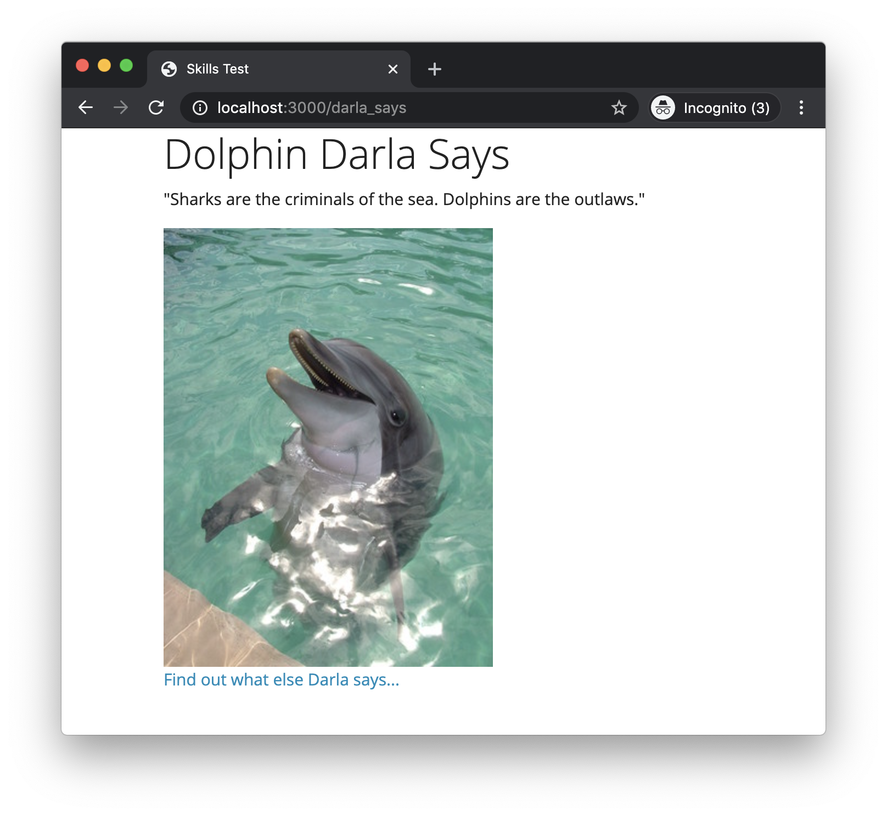

# Skills Test S2

## Part 1. Starting the Test

1. Start the screen-capture recording.

1. In your web browser, google the query string "`current time`", so the current time is displayed and captured in the recording.

1. In the terminal, change directory into the skills test project directory and verify that the working directory is clean:

    ```bash
    git status
    ```

    If there are any uncommitted changes or any untracked files in your working directory, then you will need to do something about them before proceeding.

1. In the terminal, download and checkout the branch for the test:

    ```bash
    git fetch
    git checkout --track origin/comp7012-s02
    ```

1. Initialize the project by doing the following:
   1. Install the Gems for the project using `bundle`.
   1. Install the JavaScript dependencies for the project using `yarn`.

1. Reset the database using this command:

    ```bash
    rails db:migrate:reset
    ```

## Part 2. Development Tasks

For this test, you have been given a partially complete Rails app, and it is your job to complete the app.

The web app is currently broken (so there's probably no point in trying to run it at this point).

The app is supposed to display the following page when the URL <http://localhost:3000/darla_says> is entered into the browser:



When loaded, the page should display a random quote from Dolphin Darla, and it should provide a hyperlink at the bottom of the page to get another random quote from Darla.

Your job is to fix the app, making any changes necessary; however, you must follow these constraints:

- Don't create or add any new files. All the files you need are already present in the project. Part of this test is to see that you know where to find things within a Rails project.
- Your solution must use the controller action that already exists in the project; however, the action may need correcting. Your solution must also use the `respond_to` block found in that action correctly. Your solution must pass the `random_quote` variable from the controller action to the view to be displayed as Darla's quote.
- Rails view helper methods must be used to render the image and the hyperlink. (That is, you may not use plain old HTML for these elements.)
- In addition to the view helpers, the following plain old HTML tags must be used in the view: `h1`, `p`.
- The image must be rendered as 400 pixels tall.
- The hyperlink must link back to the `darla_says` page and must use the appropriate `path` route helper method to specify the URL.

## Part 3. Test Submission

Once you've completed all of the above, submit your work by doing the following:

1. Commit all your changes to the local repo:

    ```bash
    git add -A
    git commit -m "Completed comp7012-s02"
    ```

1. Generate a ZIP archive of your project by running the following command from within the top-level folder of your project's working directory:

    ```bash
    git archive -o ../comp7012-s02-submission.zip --prefix=comp7012-s02-submission/ HEAD
    ```

    This command should result in a file `comp7012-s02-submission.zip` being created in your `workspace` folder.

1. Upload this ZIP file to the [eCourseware](https://elearn.memphis.edu/) dropbox labeled `comp7012-s02 zip (no video)`.

    **This step must be completed by the end of the test time.**

1. Stop your screen-capture recording such that a video file containing the recording is now created.

1. Upload your video recording to the [eCourseware](https://elearn.memphis.edu/) dropbox labeled `comp7012-s02 video only`. Click the "`Record Video`" link to upload your video.

    A 15-minute grace period is given beyond the end of the test time for the submission of your video.

1. Close your laptop, and sit quietly until the test period is over. You may **NOT** use your laptop or any device while you wait. However, you may, for example, read a book that you brought with you.
