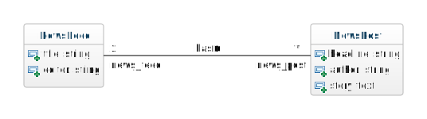
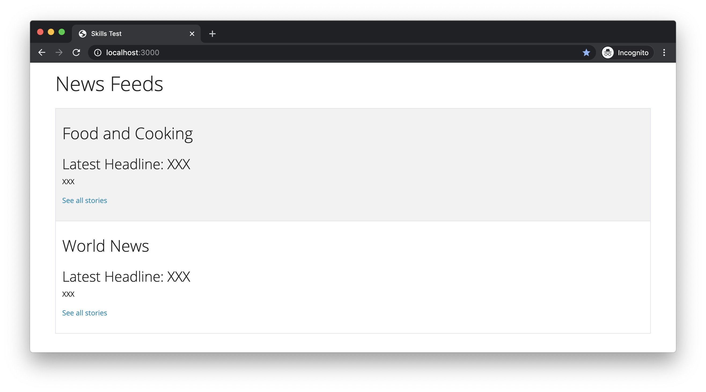
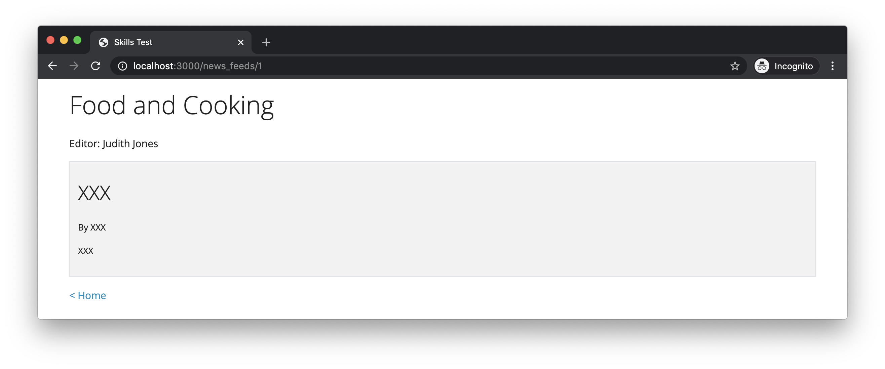
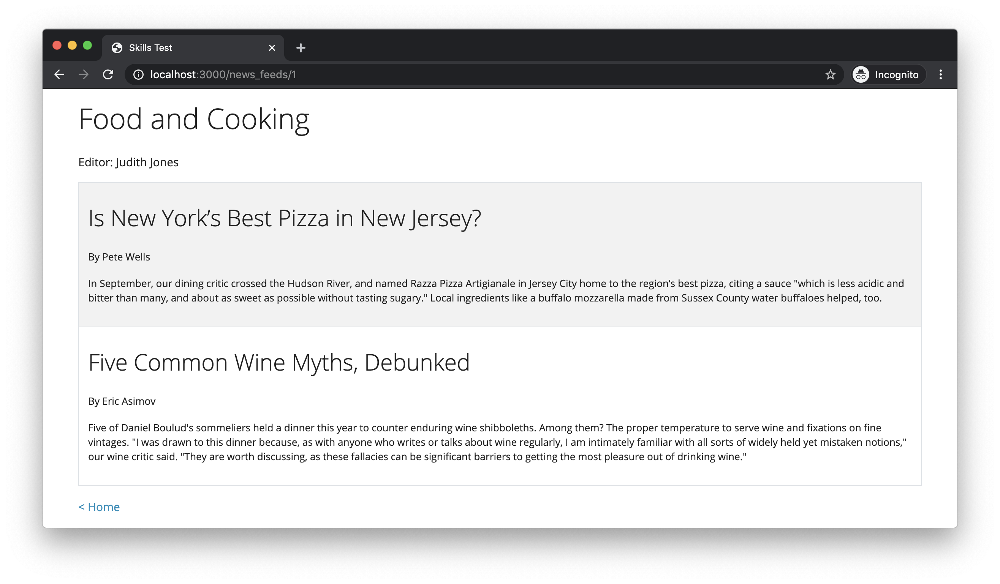

# Skills Test S6

## Part 1. Starting the Test

1. Start the screen-capture recording.

1. In your web browser, google the query string "`current time`", so the current time is displayed and captured in the recording.

1. In the terminal, change directory into the skills test project directory and verify that the working directory is clean:

    ```bash
    git status
    ```

    If there are any uncommitted changes or any untracked files in your working directory, then you will need to do something about them before proceeding.

1. In the terminal, download and checkout the branch for the test:

    ```bash
    git fetch
    git checkout --track origin/comp7012-s06
    ```

1. Initialize the project by doing the following:
   1. Install the Gems for the project using `bundle`.
   1. Install the JavaScript dependencies for the project using `yarn`.

1. Reset the database using this command:

    ```bash
    rails db:migrate:reset db:seed
    ```

Do nothing further at this point, and read on.

## Part 2. Development Tasks

For this test, you have been given a partially complete Rails-based news app, and it is your job to complete the app. In particular, there are three main tasks that you must complete:

1. Update the app's model by adding a class association.
1. Update the seed data to incorporate the changes to the model.
1. Update the existing `index` and `show` pages for the parent model class (`NewsFeed`) to display child (`NewsPost`) objects.

### Task 1. Adding a Class Association to the Model

Currently, the app's model contains two classes (`NewsFeed` and `NewsPost`), as depicted in the following class diagram:


You must update the model such that an association between the classes is added, as shown in this diagram:



### Task 2. Updating the Seed Data

Having added an association to the model, you must now update the script for seeding the database such that appropriate association links are set between the `NewsFeed` and `NewsPost` seed objects. (It should be apparent which `NewsPost` objects belong to which `NewsFeed` objects.)

### Task 3. Updating the `index` and `show` Pages

Now, run the app, and it will display the following `index` page for `NewsFeed` records when the URL <http://localhost:3000> is entered into the browser:



Clicking on one of the "`See all stories`" links will bring up a partially completed `show` page, like this:



You must complete the `index` page such that it displays the latest `NewsPost` associated with each `NewsFeed`, like this:


You must complete the `show` page such that it displays all the `NewsPost` objects associated with the `NewsFeed` record, like this:



Hint: The `last` model class method can be used to retrieve the latest `NewsPost`.

## Part 3. Test Submission

Once you've completed all of the above, submit your work by doing the following:

1. Commit all your changes to the local repo:

    ```bash
    git add -A
    git commit -m "Completed comp7012-s06"
    ```

1. Generate a ZIP archive of your project by running the following command from within the top-level folder of your project's working directory:

    ```bash
    git archive -o ../comp7012-s06-submission.zip --prefix=comp7012-s06-submission/ HEAD
    ```

    This command should result in a file `comp7012-s06-submission.zip` being created in your `workspace` folder.

1. Upload this ZIP file to the [eCourseware](https://elearn.memphis.edu/) dropbox labeled `comp7012-s06 zip (no video)`.

    **This step must be completed by the end of the test time.**

1. Stop your screen-capture recording such that a video file containing the recording is now created.

1. Upload your video recording to the [eCourseware](https://elearn.memphis.edu/) dropbox labeled `comp7012-s06 video only`. Click the "`Record Video`" link to upload your video.

    A 15-minute grace period is given beyond the end of the test time for the submission of your video.

1. Close your laptop, and sit quietly until the test period is over. You may **NOT** use your laptop or any device while you wait. However, you may, for example, read a book that you brought with you.
